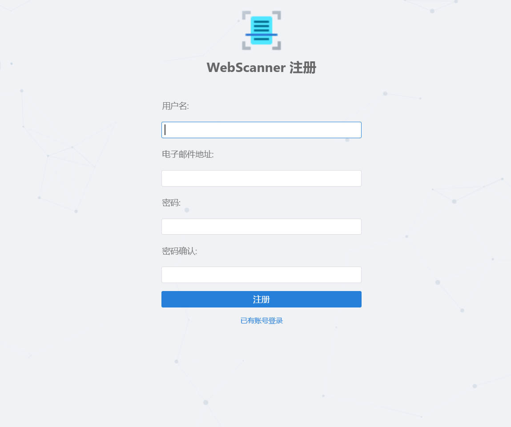
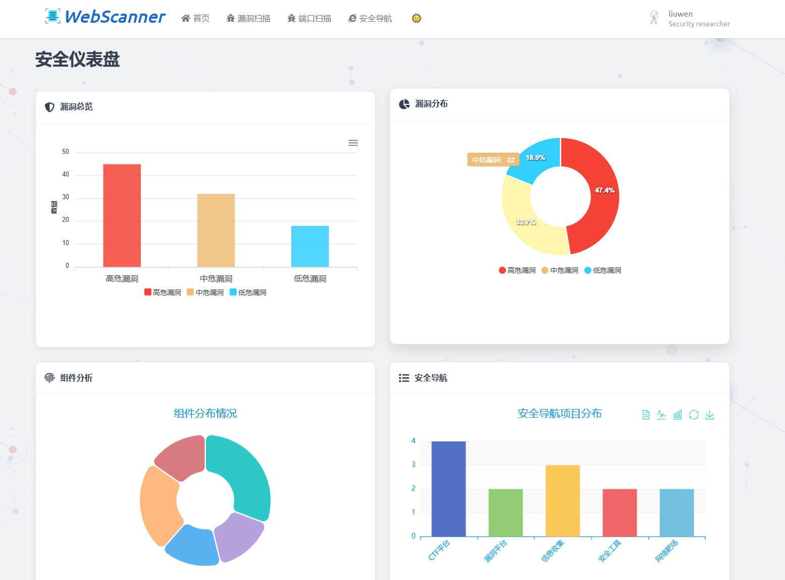
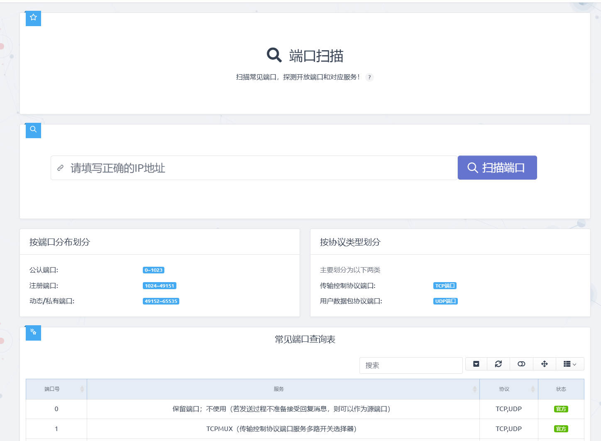
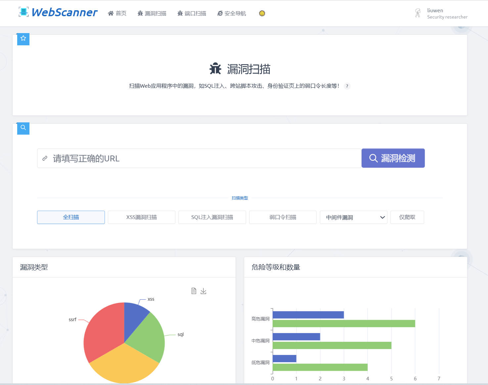

# WebScanner - 安全渗透测试系统

<p align="center">
  
  
  
  
  
</p>

<p align="center">
  
</p>

## 📖 项目介绍

WebScanner 是一款基于 **Python-Django** 的**Web应用渗透测试系统**，集成了多种安全测试工具和功能，帮助安全研究人员和网站管理员快速发现并修复网站安全隐患。

本系统通过资产收集、信息收集、漏洞扫描等一系列步骤，对Web应用进行全面检测，帮助用户发现并应对网络威胁，提升站点安全性。

## ✨ 功能特性

WebScanner 提供以下核心功能：

### 🔍 信息收集
- **端口扫描** - 检测开放端口及服务
- **目录识别** - 发现网站目录结构
- **信息泄露检测** - 检测配置文件、备份文件等敏感信息

### 🔒 漏洞检测
- **SQL注入漏洞** - 检测SQL注入风险
- **XSS漏洞** - 检测跨站脚本攻击风险
- **弱密码检测** - 评估密码强度
- **中间件漏洞** - 检测Weblogic、Struts2、Tomcat等中间件的已知漏洞
### 📊 数据分析
- **漏洞统计** - 按危险等级统计漏洞
- **组件分布** - 分析Web组件使用情况
- **安全导航** - 整合常用安全工具和资源

### 🛡️ 用户系统
- **账户管理** - 支持用户注册、登录和密码重置
- **权限控制** - 区分普通用户和管理员权限

## 🔧 技术栈

| 技术/框架 | 版本 | 用途 |
|----------|------|------|
| Python | 3.7.0 | 核心编程语言 |
| Django | 3.1.4 | Web框架 |
| SQLite | 3.35.2 | 数据存储 |
| ECharts | 5.0.1 | 数据可视化 |
| Tabler | 1.0.0 | 前端UI框架 |
| Layer | 3.2.0 | Web弹层组件 |
| Docsify | 4.11.6 | 文档网站生成 |
| SimpleUI | 2021.1.1 | Django后台美化 |
| Bootstrap Table | 1.18.2 | 数据表格 |

## 📥 安装指南

### 系统要求
- Python 3.7.0+
- pip (Python包管理器)
- Git

### 安装步骤

1. 克隆仓库
```bash
git clone https://github.com/programer-afk/WebScanner.git
cd WebScanner
```

2. 安装依赖
```bash
pip install -r requirements.txt
```

3. 初始化数据库
```bash
python manage.py migrate
```

4. 创建超级用户
```bash
python manage.py createsuperuser
```

5. 启动服务器
```bash
python manage.py runserver
```

6. 访问系统
在浏览器中打开 http://127.0.0.1:8000

## 🔍 使用说明

### 1. 用户认证
- 新用户需要注册账号并登录才能使用系统功能
- 超级用户可以登录Django后台管理系统 (/admin)

### 2. 信息收集
- 在"端口扫描"页面输入目标IP或域名进行端口扫描
- 使用"旁站探测"和"子域名扫描"功能发现更多资产

### 3. 漏洞检测
- 在"漏洞扫描"页面输入目标URL并选择扫描类型
- 选择"全扫描"可以进行全面的安全检测
- 对于中间件漏洞，需要选择特定的CVE编号

### 4. 结果分析
- 在"漏洞结果"页面查看所有扫描任务和发现的漏洞
- 点击漏洞条目可以查看详细信息和修复建议

## 📸 截图展示

### 系统仪表盘
![仪表盘]

### 用户认证
| 登录页 | 注册页 |
|-------|-------|
|  |  |
### 首页


### 漏洞扫描


### 漏洞结果


## 🤝 贡献指南

我们欢迎所有形式的贡献，包括功能请求、漏洞报告、代码贡献和文档改进。

1. Fork 项目
2. 创建功能分支 (`git checkout -b feature/amazing-feature`)
3. 提交更改 (`git commit -m 'Add some amazing feature'`)
4. 推送到分支 (`git push origin feature/amazing-feature`)
5. 开启一个 Pull Request

## 📄 开源许可

该项目采用 MIT 许可证。详情请参见 [LICENSE](LICENSE) 文件。

## 📮 联系方式

如有任何问题或建议，请通过以下方式联系：

- 项目负责人: [programer-afk](https://github.com/programer-afk)
- GitHub Issues: [https://github.com/programer-afk/WebScanner/issues](https://github.com/programer-afk/WebScanner/issues)
